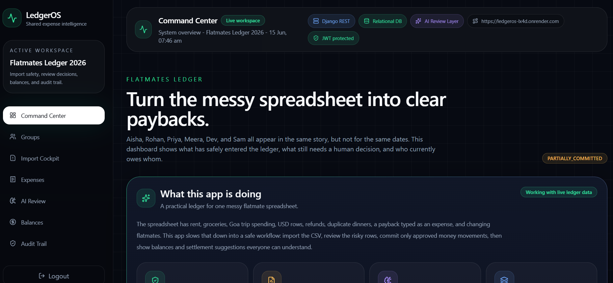

# LedgerOS - Shared Expenses Intelligence

LedgerOS is a review-first shared expenses app built for the flatmates assignment. It imports the messy `expenses_export.csv` exactly as provided, detects risky rows, asks an admin to review decisions, and commits only approved financial movements into a relational ledger.

The app is designed around the actual CSV story: Aisha, Rohan, Priya, and Meera shared a flat from February; Dev joined for a Goa trip; Meera moved out after March; Sam joined in April; some trip spending is in USD; and the spreadsheet contains duplicates, refunds, ambiguous dates, missing values, and repayments typed as expenses.



## Live Links

- Frontend: https://ledger-os-zeta.vercel.app
- Backend API: https://ledgeros-lx4d.onrender.com

Demo login:

```text
Aisha / Password@123
```

## What To Look At First

1. **Command Center**: high-level import health, live balance snapshot, and recent audit evidence.
2. **Groups**: date-aware membership timeline. This is what stops Sam from being charged for March and Meera from being charged after moving out.
3. **Import Cockpit**: upload CSV, inspect anomalies, approve/skip/convert rows, and commit only safe rows.
4. **Expenses**: committed expenses and recorded payments. Imported rows are traceable back to CSV row numbers.
5. **AI Review**: deterministic human-readable explanations for each anomaly code.
6. **Balances**: who owes whom, suggested settlements, and a per-person ledger trace.
7. **Audit Trail**: evidence of uploads, review decisions, and commits.

## Product Behavior

- Uploading a CSV never directly changes balances.
- Import creates `ImportBatch`, `ImportRow`, and `ImportIssue` records.
- Rows with unresolved issues stay blocked or under review.
- Approved valid rows can be committed into `Expense` or `Settlement` records.
- Balances are calculated only from committed ledger rows.
- Every balance number can be traced to expense paid, share owed, settlement paid, or settlement received entries.

## Assignment Requirements Covered

| Requirement | Where implemented |
| --- | --- |
| Login module | JWT login with demo user Aisha |
| Create/manage groups | Groups page and `GroupMembership` model |
| Membership changes over time | `joined_at` and `left_at` on memberships |
| Create/manage expenses | Expenses page and DRF expense endpoints |
| Split types in CSV | Equal, exact/unequal, percentage, share |
| Balances and summaries | Balances page and backend balance calculator |
| Settle debts/payments | `Settlement` model and payment form |
| Import CSV exactly as provided | Import Cockpit upload flow |
| Detect/surface anomalies | Import issues, AI Review, review queue |
| Relational DB only | Django models on PostgreSQL/SQLite |

## Stack

- Backend: Django, Django REST Framework, SimpleJWT
- Database: PostgreSQL on Neon for deployment; SQLite works for local development/tests
- Frontend: React, TypeScript, Vite, Tailwind CSS
- Deployment: Render backend, Vercel frontend
- Planning aid: diagrams.net/draw.io for relational structure visualization

## Local Setup

### Backend

```powershell
cd backend
.\.venv\Scripts\python.exe manage.py migrate
.\.venv\Scripts\python.exe manage.py seed_demo
.\.venv\Scripts\python.exe manage.py runserver
```

`seed_demo` is safe to run more than once. It creates or updates demo users, makes Aisha an admin, and creates the `Flatmates Ledger 2026` workspace.

Demo membership timeline:

| Person | Role | Joined | Left |
| --- | --- | --- | --- |
| Aisha | Admin | 2026-02-01 | Active |
| Rohan | Member | 2026-02-01 | Active |
| Priya | Member | 2026-02-01 | Active |
| Meera | Member | 2026-02-01 | 2026-03-29 |
| Dev | Member | 2026-02-08 | 2026-03-14 |
| Sam | Member | 2026-04-08 | Active |

To force local SQLite:

```powershell
$env:DATABASE_URL='sqlite:///db.sqlite3'
.\.venv\Scripts\python.exe manage.py migrate
.\.venv\Scripts\python.exe manage.py seed_demo
```

### Frontend

```powershell
cd frontend
npm install
npm run dev
```

For deployed or remote backend usage:

```text
VITE_API_BASE_URL=https://ledgeros-lx4d.onrender.com
```

## Demo Script

1. Login as Aisha.
2. Open Groups and point out membership dates.
3. Open Import Cockpit and upload `backend/expenses_export.csv`.
4. Show that upload creates a review report, not expenses.
5. Approve/skip/convert one issue and show the row status changing.
6. Commit valid rows.
7. Open Expenses and trace a committed row back to its CSV row number.
8. Open Balances and walk through Aisha or Rohan by hand.
9. Open Audit Trail and show evidence of upload/review/commit.

## Deployment Notes

Render backend environment:

```text
DEBUG=False
DATABASE_URL=<Neon PostgreSQL URL>
ALLOWED_HOSTS=ledgeros-lx4d.onrender.com
CORS_ALLOWED_ORIGINS=https://ledger-os-zeta.vercel.app
USD_TO_INR_RATE=83.00
```

Vercel frontend environment:

```text
VITE_API_BASE_URL=https://ledgeros-lx4d.onrender.com
```

The frontend includes `frontend/vercel.json` so direct links like `/balances` and unknown routes are handled by the React router instead of Vercel's static 404.

After a fresh Render database migration, run:

```bash
python manage.py seed_demo
```

## Verification

Backend:

```powershell
cd backend
$env:DATABASE_URL='sqlite:///test_local.sqlite3'
.\.venv\Scripts\python.exe manage.py test --noinput
```

Frontend:

```powershell
cd frontend
npm run build
```

Current verified result:

- Backend tests: 14 passing
- Frontend production build: passing
- Live ledger balances net to zero after removing manual test rows

## Import Report Deliverable

The app produces an import report for each uploaded CSV batch.

In the UI:

`Import Cockpit -> Import report -> Download JSON report`

API endpoint:

`GET /api/imports/{batch_id}/report/`

For the seeded demo batch:

`GET /api/imports/1/report/`

The report lists every anomaly detected, CSV row number, severity, policy, suggested action, current row/issue status, and reviewer action taken.

## Required Documents

- `SCOPE.md`: anomaly log, import policy, and schema.
- `DECISIONS.md`: product and engineering decision log.
- `AI_USAGE.md`: AI tools used, prompts, mistakes caught, and corrections made.
